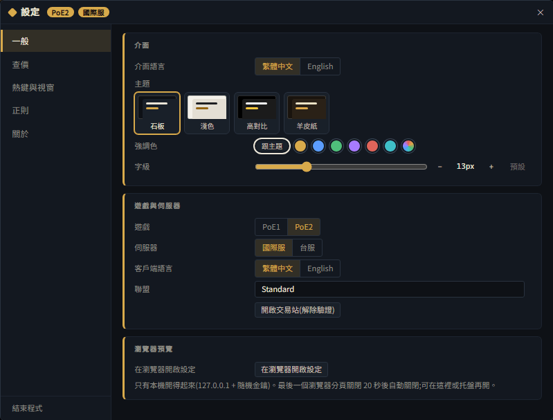
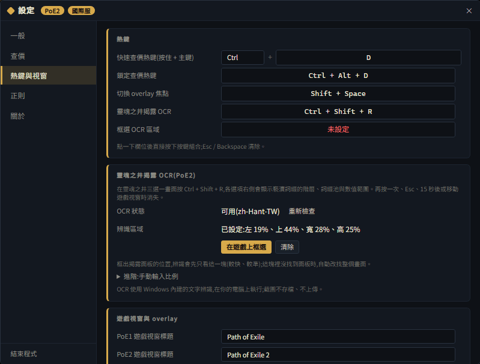
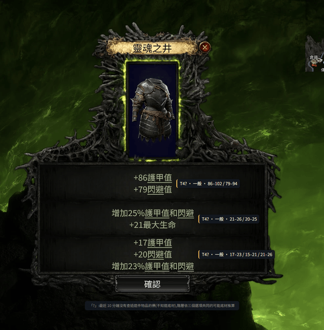
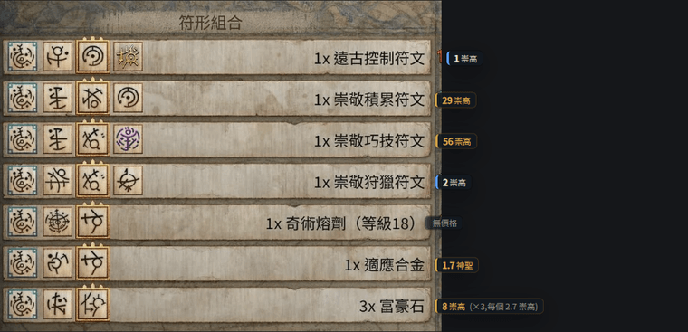
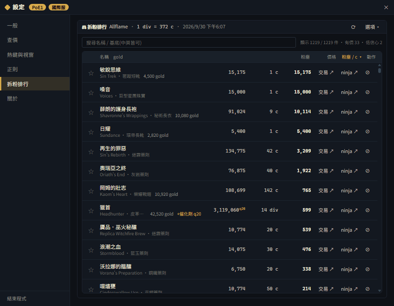

# ExileAppraiser(流亡鑑價)

[English](README.en.md) | **繁體中文**

Path of Exile 1 / 2 查價工具:在遊戲裡把滑鼠移到物品上按熱鍵,官方交易站的查價結果直接在游標旁彈出。支援國際服與台服、繁體中文與英文客戶端。

> 前身名稱 `poe-price-zh`;舊版的設定會在第一次啟動時自動搬過來。

## 下載

僅支援 **Windows**。到 **[Releases 最新版](https://github.com/Hsiung-Shao/exile-appraiser/releases/latest)** 下載:

| 檔案 | 用途 |
|---|---|
| `ExileAppraiser-Setup-<版本>.exe` | **安裝版,建議下載。** 預設只為目前使用者安裝到使用者資料夾,不需要系統管理員權限,會建立捷徑(也可以自選安裝位置)。**只有安裝版會自動更新**:在背景下載新版,結束程式時套用;可在「設定 › 關於」關閉。 |
| `ExileAppraiser-<版本>-portable.exe` | 免安裝版,雙擊直接執行。**不會自動更新**;有新版時「設定 › 關於」會提示,按「前往 Releases」自行下載。 |
| `ExileAppraiser-Setup-<版本>.exe.blockmap` | 自動更新用(差分下載,只抓有變動的部分)。**不需要下載。** |
| `latest.yml` | 自動更新用(版本資訊與檔案雜湊驗證)。**不需要下載。** |
| Source code (zip / tar.gz) | GitHub 自動附上的原始碼。一般使用者不需要。 |

**Windows SmartScreen 提示**:本程式沒有程式碼簽章,第一次執行可能出現「Windows 已保護您的電腦」。確認檔案是從上面的 Releases 頁下載的,點 **「其他資訊」→「仍要執行」** 即可。

## 目錄

- [特色](#特色)
- [快速上手](#快速上手)
- [功能教學](#功能教學)
  - [靈魂之井三選一辨識(PoE2)](#靈魂之井三選一辨識poe2)
  - [符文塑形自動查價(PoE2)](#符文塑形自動查價poe2)
  - [Poe Regex 搜尋字串產生器](#poe-regex-搜尋字串產生器)
  - [拆粉排行(PoE1)](#拆粉排行poe1)
  - [聊天指令與倉庫搜尋](#聊天指令與倉庫搜尋)
  - [瀏覽器預覽設定](#瀏覽器預覽設定)
- [常見問題](#常見問題)
- [隱私](#隱私)
- [贊助與社群](#贊助與社群)
- [授權與致謝](#授權與致謝)

## 特色

- **PoE1 與 PoE2 一支搞定**:依前景的遊戲視窗自動切換,不必手動改設定。
- **國際服 / 台服**:兩區交易站都能查;繁體中文與英文客戶端的物品文字都能解析。
- **遊戲內 overlay 查價**:查價面板疊在遊戲上、出現在游標旁;也可以改成獨立視窗模式。
- **介面語言另外切換**(中文 / English),與客戶端語言互不影響;四種主題、強調色與字級可調;查價面板與設定視窗可換成自己的背景圖(PNG / JPG / WebP,亮度、面板不透明度、霧面可調)。
- **Poe Regex 搜尋字串產生器**:勾選詞綴 / 名稱,產生可貼進遊戲搜尋列的字串;支援多頁合併、書籤、分享碼與範本。
- **拆粉排行(PoE1)**:查價面板顯示傳奇能拆出的粉塵量,另有全部傳奇的拆粉效率排行。
- **PoE2 褻瀆詞綴 Tier**:查價時直接顯示遊戲給的 Tier;只有一般複製文字時依 PoB2 詞綴資料推定並標示「推定」。
- **PoE2 靈魂之井三選一辨識(OCR)**:打開揭露面板就自動辨識,每個選項旁標出褻瀆詞綴的 Tier、詞綴池與數值範圍。
- **PoE2 符文塑形自動查價**:開著符文塑形面板時,每一列旁自動標出 poe.ninja 參考價。
- **聊天指令與倉庫搜尋熱鍵**:按一個鍵就輸入 `/hideout`、`@last ty` 等聊天指令,或把常用字串輸入倉庫搜尋框(PoE1 / PoE2 都能用)。
- **瀏覽器預覽設定**:用一般瀏覽器看、改設定,改動即時同步回 overlay。
- **自動更新**:安裝版在背景下載新版、結束程式時套用,之後只下載有變動的部分。
- **啟動提示**:啟動後右下角短暫顯示「已在背景執行」與查價熱鍵,更新後顯示新版號。
- **一鍵回報**:查價出錯時整理成 GitHub issue 草稿,由你確認後自己送出。
- **匿名查詢**:不需要登入,也不需要 POESESSID。

## 快速上手

### 1. 第一次啟動

- 程式啟動後在背景執行,沒有主視窗。螢幕右下角會短暫顯示「流亡鑑價 已在背景執行」與查價熱鍵(可在「設定 › 一般」關閉這個提示)。
- 程式圖示在 **系統匣**(工作列右下角)。右鍵選單有:顯示、設定、在瀏覽器開啟設定、檢查更新、開啟設定資料夾、關於、結束。
- 開啟設定的方式:
  - 系統匣圖示右鍵 →「設定」;
  - 遊戲中沒有開著查價面板時按 **`Shift + Space`**(切換 overlay 焦點);
  - 查價面板標題列的齒輪 ⚙。

### 2. 基本設定(設定 › 一般)

1. **介面語言**:程式本身的顯示語言(繁體中文 / English)。
2. **遊戲**:PoE1 / PoE2。預設會依前景的遊戲視窗自動切換(「設定 › 熱鍵與視窗」的「自動切換 PoE1 / PoE2」)。
3. **伺服器**:國際服(`pathofexile.com`)或台服(`pathofexile.tw`)。台服目前只支援繁體中文客戶端。
4. **客戶端語言**:你的**遊戲**是繁體中文還是英文。這決定程式怎麼讀複製出來的物品文字,選錯會解析失敗。
5. **聯盟**:選你要查價的聯盟。清單載不出來時按「開啟交易站(解除驗證)」,在跳出的視窗完成一次 Cloudflare 驗證。

設定變更會自動儲存。

### 3. 查價

預設熱鍵(都可在 **設定 › 熱鍵與視窗** 修改:點一下欄位後直接按下新的組合鍵,`Esc` / `Backspace` 清除):

| 熱鍵 | 預設 | 作用 |
|---|---|---|
| 快速查價 | `Ctrl + D` | 按住 `Ctrl` 再按 `D`,面板出現在游標旁。**繼續按住 `Ctrl`** 把滑鼠移進面板就能操作;放開 `Ctrl` 後把滑鼠移開,面板自動關閉。 |
| 鎖定查價 | `Ctrl + Alt + D` | 面板可以直接點擊,不會因為移動滑鼠而關閉,適合慢慢調整篩選。 |
| 切換 overlay 焦點 | `Shift + Space` | 在遊戲與 overlay 之間切換焦點;沒有查價面板時會打開設定。 |

步驟:

1. 遊戲視窗在前景時,滑鼠移到物品上按查價熱鍵。程式會替你送出複製鍵讀取物品文字:
   - **PoE1**:送出 `Ctrl + C`。
   - **PoE2**:送出 `Ctrl + Alt + C`(進階複製),才拿得到遊戲給的褻瀆詞綴 Tier。目前以遊戲預設的 `Alt` 當作「顯示進階說明」鍵;若你在遊戲裡改過這個鍵,暫不支援。
2. 面板列出物品的詞綴篩選:**勾選**要納入搜尋的詞綴、調整數值範圍(預設容差在「設定 › 查價」)。
3. 傳奇、通貨等物品會直接開始查詢;其他物品調整好篩選後按 **「搜尋」**。
4. 想在網頁上看完整結果,按 **「交易」** 會用系統瀏覽器開啟交易站的同一個搜尋。
5. 查價出錯時可以按面板下方的「回報這件」,程式會整理成 GitHub issue 草稿(不會自動送出、不含帳號名)。

> 也可以手動貼上:查價面板沒有物品時(或按面板下方的「貼上另一件」),把物品文字(遊戲中 `Ctrl + C` 複製的內容)貼進去按「解析」。

其他查價選項在 **設定 › 查價**:詞綴數值容差、預設價格通貨(只影響 PoE1)、顯示賣家、查價後還原剪貼簿、帳號名稱(用來標記自己的掛單,可留空)。

## 功能教學

### 靈魂之井三選一辨識(PoE2)

靈魂之井的三選一揭露面板無法複製文字,所以改用 Windows 內建的文字辨識(OCR)讀畫面。

**條件**:PoE2、overlay 模式、**繁體中文遊戲客戶端**、已安裝 Windows 繁中 OCR 語言包。

**安裝繁中 OCR 語言包**(只需一次):

1. Windows 設定 → **時間與語言** → **語言與地區**。
2. 在「中文(台灣)」點 **⋯ → 語言選項**(清單裡沒有就先「新增語言」加入)。
3. 在「光學字元辨識」按 **下載**。
4. 回到程式的 **設定 › 熱鍵與視窗**,「OCR 狀態」顯示「可用(zh-Hant-TW)」即可(可按「重新檢查」)。

**使用**:

1. 打開靈魂之井三選一畫面,程式會自動辨識(預設開啟,可在「設定 › 熱鍵與視窗」關閉)。
2. 每個選項右側出現 `Tier · 詞綴池 · 數值範圍` 的徽章;開著查價面板時也會照常辨識。
3. 關掉揭露面板徽章就消失。**`Ctrl + Shift + R`** 暫停 / 繼續自動辨識。

- 徽章出現 **「?」**:最近 10 分鐘內沒有查過這件物品的價,程式不知道底材,只能依三個選項共同可能的底材推算。**先對物品查一次價再開揭露面板**,結果會更精確。
- **框選辨識區域(可選)**:在「設定 › 熱鍵與視窗」按「在遊戲上框選」,在遊戲畫面上拖曳框出揭露面板,`Enter` 確認、`Esc` 取消。之後辨識會先只看這一塊(較快、較準),這塊裡沒找到面板時自動改找整個畫面。
- **設定**(褻瀆與符文塑形兩個區塊的項目相同):啟用、目前狀態、掃描間隔(預設 1000 ms,可設 100–3000;低於 500 ms 較吃 CPU)、辨識區域、暫停 / 繼續熱鍵、框選區域熱鍵(預設未設定)。

### 符文塑形自動查價(PoE2)

開著符文塑形面板時,程式定時辨識面板,在每一列右側標出 poe.ninja 參考價。只截圖 + 本機 OCR,不送任何按鍵。

**條件**:PoE2、overlay 模式、繁體中文遊戲客戶端、已安裝繁中 OCR 語言包(步驟同上)。poe.ninja 參考價只有**國際服**;台服改為自動查台服交易站(見下面的「自動查市集」)。

**開啟**:設定 › 熱鍵與視窗 → 勾選「啟用符文塑形自動查價(PoE2、疊加模式)」(預設關閉)。

- **面板區域**:不框選時自動尋找面板(約每 3 秒看一次整個畫面,找到後只掃面板那一塊)。辨識不穩時可手動框選,框住面板上所有物品列(含數量)。手動區域內找不到面板時**不會**自動改掃整個畫面,請重新框選或清除區域。
- **掃描間隔**:預設 1000 ms(可設 100–3000;低於 500 ms 會明顯吃 CPU)。覺得吃 CPU 就調大。查價面板、設定或框選層開著、或遊戲不在前景時自動暫停。
- **暫停 / 繼續熱鍵**、**框選區域熱鍵**:預設未設定,可在本區塊內自行指定。

**怎麼看徽章**:

| 徽章 | 意思 |
|---|---|
| `29 崇高`、`1.7 神聖` | 參考價。以崇高石計,滿 1 神聖石改用神聖石;數量大於 1 時顯示總價與單價。 |
| 金色 | 總價 ≥「高於」門檻(預設 5 崇高)。 |
| 強調色左框 | 介於兩個門檻之間。 |
| 暗色 | 總價 <「低於」門檻(預設 0.5 崇高)。兩個門檻都能在設定裡改。 |
| 名稱前的 `≈` | 名稱是模糊比對到的,可能不準。 |
| **無價格** | 是具體物品,但 poe.ninja 沒有價格,而且查不了交易站(例如還沒選聯盟)。查得了的會改顯示下面的「市」。 |
| **無固定價格**(虛線、斜體) | 泛稱獎勵,例如「維里西姆堆」、隨機通貨、某部位的任一傳奇,本來就沒有單一市價。 |
| `市 80 崇高 · L20`(藍色左框) | 自動查到的交易站價格(最便宜 10 筆的中位數;不到 3 筆顯示最低價並標「少」)。`·` 後面是關鍵篩選:`L20` = 寶石等級 20、`等級不限` = 面板沒寫等級。 |
| `市 …` / `市 查詢中` | 排隊中 / 正在查交易站。 |
| `?` | 對不上物品名稱(或同名有多個候選),不查價。 |
| (沒有徽章)「未發現」 | 尚未解鎖的配方,不標。 |

**自動查市集**:沒有 poe.ninja 價的列(例如技能寶石、沒收錄的等級;台服是全部)會自動排隊查交易站,不必點。
寶石一律帶**未汙染、品質 0**,面板寫了等級(`技能等級 20：…`)就只查該等級,避免被高規格掛單誤導;完整篩選寫在程式記錄裡。
一次只查一筆、每筆最多 1 次搜尋 + 1 次取明細;同一組篩選 30 分鐘內不重查。為了**不影響平常的查價**:交易站限流額度不夠時自動延後、查價面板或設定開著時暫停、交易站回 429 時整個佇列停到解除;面板關掉就清掉還沒送出的查詢。台服以掛單原幣顯示。

### Poe Regex 搜尋字串產生器

在 **設定 › 正則**。

1. 上方選遊戲與清單(PoE1:地圖、探險日誌、聖甲蟲、藥劑、星團珠寶、寶石、紋身、劫盜裝備、劫盜契約、商店基底等;PoE2:換界石、碑牌、聖物、探險遺物、藥劑護符、寶石、商店基底等;另有地圖數值與商店條件頁)。
2. 勾選想找的詞綴 / 名稱;數值條件(地圖階級、物品數量、稀有度等)可設「≥ / ≤ / 區間」。
3. 選模式:**含任一個** / **全部都有** / **一個都沒有**(排除字串)。
4. 選輸出語言(**繁體中文 / English**,必須和你的遊戲客戶端一致)。
5. 按「複製」,貼進遊戲的搜尋列(倉庫、商店等)。

- **合併**:各頁勾選合成一串,會檢查跨頁誤中與長度上限。
- **書籤**:把常用的一組勾選存起來,之後一鍵載入。
- **分享碼**:整組勾選壓成一串分享碼給別人,貼上即還原。
- **範本**:內建常用組合(例如 T17 危險詞綴、地圖無反射、6L 商店、換界石危險詞綴)。

### 拆粉排行(PoE1)

- 對傳奇物品查價時,面板會顯示這件能拆出多少粉塵;有 poe.ninja 價格時換算成每混沌石幾粉塵。
- **拆粉排行**在設定視窗的「拆粉排行」分頁(查價面板標題列的 ⚖ 也會開到這裡)。列出所有傳奇,可依「粉塵 / c」「粉塵 / 總成本」「粉塵 / gold」「粉塵 / c / 格」排序,並考慮物品等級、品質、飾品催化劑、gold 手續費與固有勢力。
- 每列的「交易 ↗」「ninja ↗」會用**系統瀏覽器**開啟交易站搜尋或 poe.ninja 頁面。
- 價格來自 poe.ninja,**只有國際服**;台服只顯示粉塵量。

### 聊天指令與倉庫搜尋

- 在「設定 › 聊天指令」設定。預設 `F5` = `/hideout`(回藏身處)、`F9` = `/exit`;`@last ty`、`/invite @last` 等可自行指定熱鍵。
- `@last` = 最後一個私訊你的人;沒勾「直接送出」時只貼進聊天框,讓你改完再按 Enter。
- **倉庫搜尋**:按熱鍵把字串輸入倉庫搜尋框。可在「正則」分頁按「加到倉庫搜尋」直接帶入。
- 熱鍵只在疊加模式、遊戲視窗在前景時有效;遊戲自己會用到的按鍵(`Ctrl + C`、`Enter` 等)不能當熱鍵。
- 這個功能會透過剪貼簿貼上文字並對遊戲送出按鍵(與 Awakened PoE Trade 相同做法)。

### 瀏覽器預覽設定

- 系統匣選單或「設定 › 一般」的「在瀏覽器開啟設定」,用一般瀏覽器看、改設定,改動即時套用回程式。
- 只在本機開放(`127.0.0.1` + 隨機金鑰),別台電腦開不起來。最後一個瀏覽器分頁關閉 20 秒後自動關閉。
- 在瀏覽器裡改遊戲、overlay 模式或視窗標題,要下次啟動程式才生效。

## 常見問題

<b>按熱鍵沒反應 / overlay 沒有出現在遊戲上</b>

- 遊戲請使用 **無邊框視窗** 或 **視窗模式**。全螢幕獨占模式下 overlay 可能蓋不上去,OCR 也可能擷取到黑畫面。
- overlay 模式只在遊戲視窗位於前景時作用。確認「設定 › 熱鍵與視窗」的「PoE1 / PoE2 遊戲視窗標題」與遊戲視窗標題相符(預設 `Path of Exile` / `Path of Exile 2`)。
- 熱鍵被其他程式佔用時,設定頁會提示「已被其他程式佔用」,請換一組按鍵。
- 不想用 overlay,可以在「設定 › 熱鍵與視窗」取消「疊加在遊戲上」改用獨立視窗(會自動重新啟動)。

<b>聯盟清單載不出來 / 交易站出現驗證頁</b>

交易站前面有 Cloudflare 防護。到「設定 › 一般」按 **「開啟交易站(解除驗證)」**,在跳出的視窗完成一次驗證後再按「重試」。

若顯示「限流中」,是交易站的查詢頻率限制,程式會在倒數結束後自動重試。

<b>OCR 認不出來 / 找不到面板</b>

- 先確認「設定 › 熱鍵與視窗」的「OCR 狀態」為「可用」;缺語言包請照[上面的步驟](#靈魂之井三選一辨識poe2)安裝。
- 遊戲 UI 亮度太低會影響辨識。
- 用框選功能把辨識範圍縮小到面板上,通常更快也更準;面板位置變了(換解析度、UI 縮放)就重新框選。
- 目前只支援繁體中文遊戲客戶端。

<b>台服和國際服有什麼不同?</b>

- 台服查詢 `pathofexile.tw`,目前只支援繁體中文客戶端。
- poe.ninja 沒有台服價格,因此台服沒有拆粉價格(只顯示粉塵量);符文塑形徽章沒有參考價,改為自動查台服交易站(原幣顯示)。

<b>設定存在哪裡?</b>

設定變更會自動儲存,存在 `%APPDATA%\exile-appraiser\config.json`。系統匣選單的「開啟設定資料夾」可以直接打開這個資料夾。

<b>怎麼關閉自動更新?</b>

「設定 › 關於」→ 取消「自動更新」。關閉後有新版時需要自己按「下載」與「安裝」。免安裝版本來就不會自動更新。

## 隱私

- **OCR 在本機執行**:使用 Windows 內建的文字辨識,截圖不存檔、不上傳,辨識時也不會對遊戲送出任何按鍵。
- **匿名查詢**:只向官方交易站與 poe.ninja 發出匿名查詢,不需要登入、不需要 POESESSID。
- **回報由你決定**:「回報」只會開啟預填好的 GitHub issue 頁面,內容由你確認後自己送出。

## 贊助與社群

如果這個工具對你有幫助,歡迎支持 **本專案(ExileAppraiser)的維護者**。這些連結贊助的是本專案的維護工作,不是下方致謝中的 Awakened PoE Trade / Exiled Exchange 2 原作者;支持原作者請見[授權與致謝](#授權與致謝)。

- Buy Me a Coffee:https://buymeacoffee.com/hsiung
- Patreon:https://patreon.com/HsiungShao
- Discord(PoE 身分組):https://discord.gg/6VamPQb8nC
- 個人網站:https://hsiung-shao.github.io/

問題回報與建議請到 [GitHub Issues](https://github.com/Hsiung-Shao/exile-appraiser/issues)。

## 授權與致謝

本專案以 [MIT 授權](LICENSE) 釋出。

本工具建立在以下專案之上,也請考慮支持原作者:

- [Awakened PoE Trade](https://github.com/SnosMe/awakened-poe-trade)(SnosMe,MIT):PoE1 剪貼簿解析、篩選器、交易查詢與資料檔(經由繁中 fork [awakened-poe-trade-zh-TW](https://github.com/Hsiung-Shao/awakened-poe-trade-zh-TW))。支持原作者:https://patreon.com/awakened_poe_trade
- [Exiled Exchange 2](https://github.com/Kvan7/Exiled-Exchange-2)(Kvan7,MIT):PoE2 剪貼簿解析、篩選器、交易查詢、資料檔與圖示(經由繁中版 [Exiled-Exchange-2-zh-TW](https://github.com/Hsiung-Shao/Exiled-Exchange-2-zh-TW))。
- [poe-disenchant-tool](https://github.com/deronek/poe-disenchant-tool)(deronek,MIT)與 [@alserom](https://gist.github.com/alserom/22bdd4106806cbd4f85a5cb8c4345c08) 整理的 poe-dust 資料:拆粉的 gold 手續費、背包格數與交叉比對數值。

其他第三方元件的授權聲明見 [`NOTICE.md`](NOTICE.md) 與 [`LICENSES/`](LICENSES/)。

Path of Exile、遊戲內名詞、物品與相關資料為 Grinding Gear Games 所有。本專案與 Grinding Gear Games 無關,亦未獲其背書。
